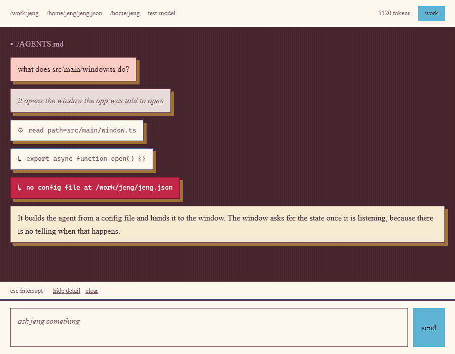
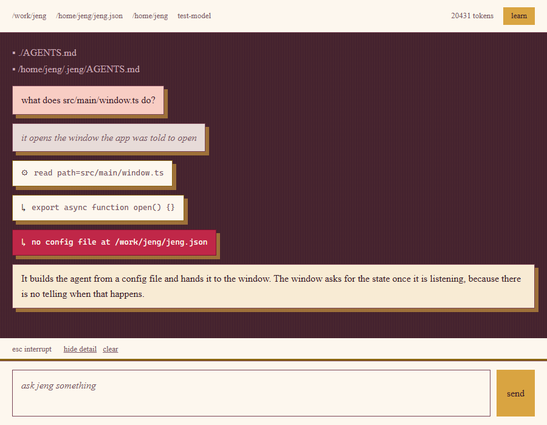
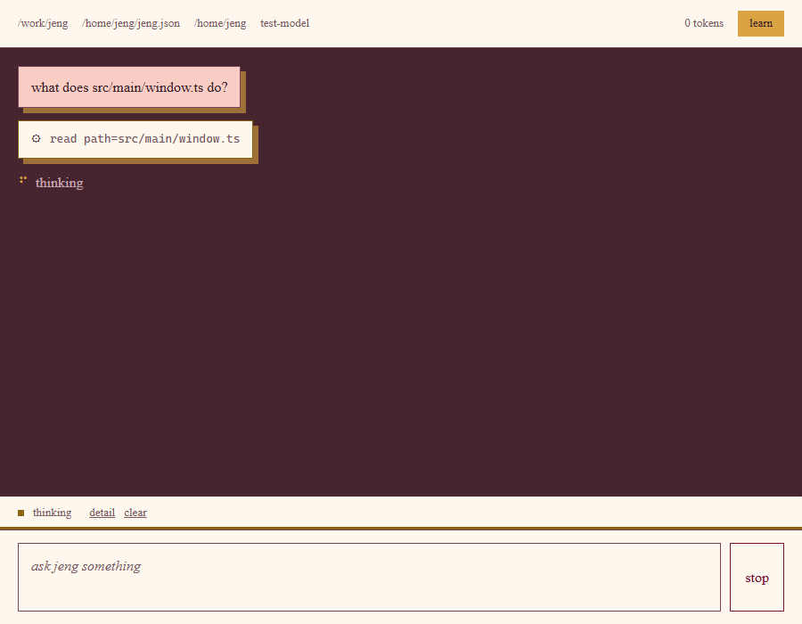
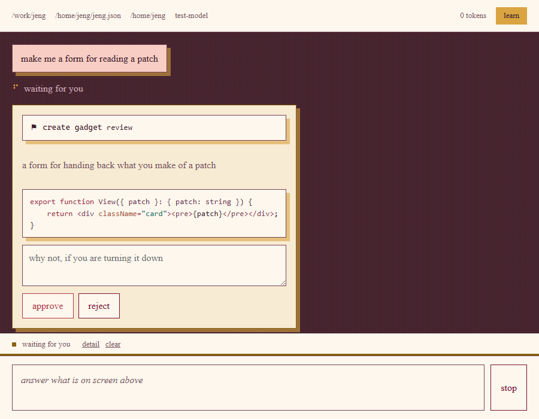
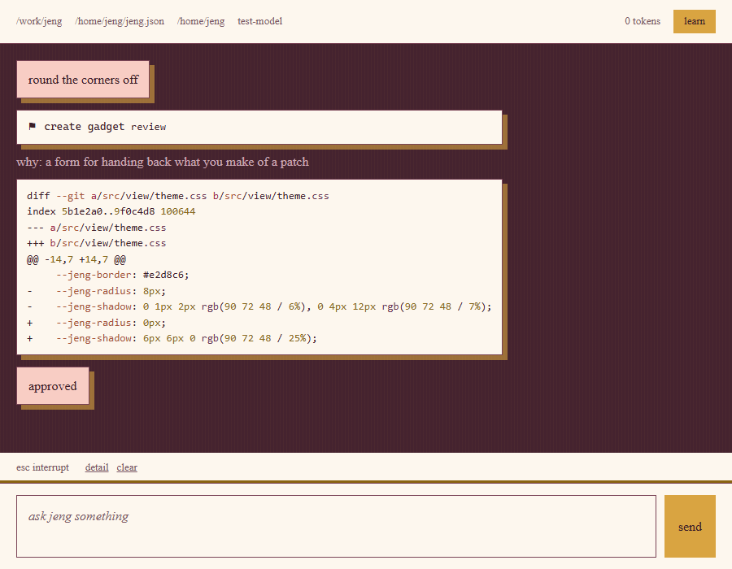
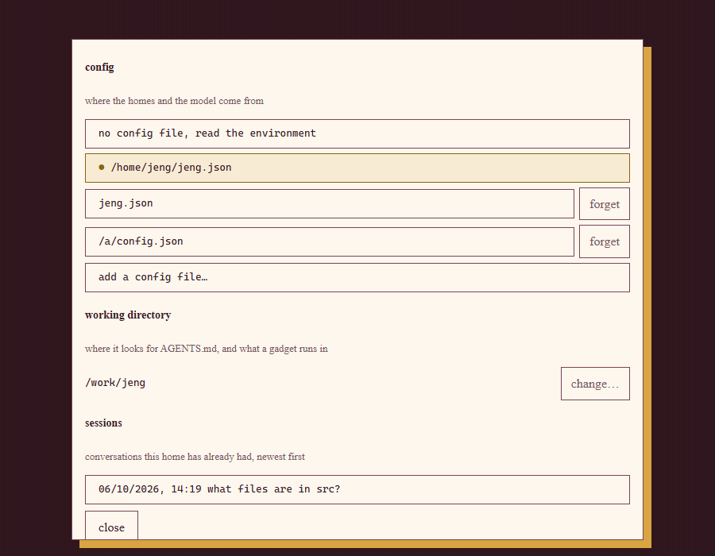

# Jeng - An agent for you.

Jeng is a bare-bones agent that starts out with zero context and evolves to fit your specific needs.
It is not opinionated, and it starts out knowing nothing except how to learn.
This means that it is an agent that works well with tiny models, since it uses nearly no context out of the box.

## Installation

```sh
bun run setup
```

This builds Jeng into a single executable with `bun run build` and installs it as `jeng` in `~/.jeng/bin`, adding that folder to your PATH if it isn't there yet. Open a new terminal afterwards. `bun run build` alone just writes the executable to `dist/jeng` (`dist/jeng.exe` on Windows).

## Configuration

Jeng talks to any OpenAI-compatible endpoint, so a local model works as well as a hosted one.
A config file is JSON, so you can keep one per agent and pick between them:

```json
{
    "homes": ["~/.jeng", "~/work-agent"],
    "model": {
        "baseUrl": "http://localhost:11434/v1",
        "apiKey": "sk-...",
        "model": "gpt-4o-mini",
        "contextWindow": 8192
    }
}
```

Point Jeng at one with `-c`:

```sh
jeng -c ~/agents/researcher.json "what files are in src?"
```

A home is a folder Jeng writes to, so a home of `~` on its own is rejected: that is your
whole home folder rather than a folder inside it. Use `~/.jeng` or name a subfolder.

Without `-c`, Jeng looks for `./jeng.json`, then `jeng.json` inside the first home folder.
Every key is optional, and any key you leave out falls back to its default.

Once a config file is found it is the only source of configuration; the environment is
read only when there is no config file, which keeps existing setups working:

| Variable       | Default                      | Meaning                        |
| -------------- | ---------------------------- | ------------------------------ |
| `JENG_BASE_URL`| `http://localhost:11434/v1`  | OpenAI-compatible base url     |
| `JENG_API_KEY` | `OPENAI_API_KEY`             | sent as a bearer token if set  |
| `JENG_MODEL`   | `gpt-4o-mini`                | model name                     |
| `JENG_CONTEXT` | `8192`                       | context window, in tokens      |
| `JENG_HOME`    | `~/.jeng`                    | `;`-separated home folders     |

## How to use?

```sh
jeng --help
```

Run `jeng` on its own for the TUI, or pass a prompt to run once and exit:

```sh
jeng "what files are in src?"
```

A prompt can also be piped in, which is how you hand Jeng a whole file:

```sh
cat src/index.ts | jeng "what does this do?"
```

A piped run has no terminal to ask on, so it cannot create anything: pass `-y`/`--yes` if the
run is yours and you trust it to write to the home folder.

Jeng keeps going until it ends its turn with an answer or you interrupt it with `esc`. Pass
`--max-turns <n>` if you would rather it gave up after that many calls.

## Sessions

A conversation is written down in the first `--home` folder, so you can pick it back up
later. Each one is a file in `<home>/sessions`, named after when it happened.

```sh
jeng --sessions
jeng --session 2026-10-06T14-02-11.204
```

`--sessions` lists them newest first and exits. `--session <id>` starts on one, and takes a
prompt like anything else: `jeng --session <id> "what was left to do?"`. A session carries
the directory, homes, config and mode it was working under, so `--session` refuses to be
combined with `--config`, `--home` or `--mode` rather than quietly ignoring one of them.

In the TUI, `ctrl+p` lists them without leaving it: `up` and `down` to choose, `enter` to
load, `esc` to put the list away. Loading one is the same as starting on it: the working
directory moves to where that conversation was.

A conversation is written down every five exchanges, before it is cleared, and on the way
out — so a run killed with `ctrl+c` loses at most a few exchanges. `ctrl+l` writes the
conversation down before clearing it, and what comes after is a session of its own.

A piped or one-shot run keeps what the model was told rather than a transcript, because it
printed that to stdout instead of showing one.

## Modes

Jeng has two modes, and which one it is in decides whether it may change its home.

| Mode   | Does                                                                              |
| ------ | --------------------------------------------------------------------------------- |
| `learn` | the default; grows the home, writing gadgets and protocols as it goes              |
| `work` | uses only what the home already holds and cannot write to it at all                 |

The window tints its accent to the mode, and wears the terminal's two so the same sentence reads the
same way in both: the badge in the header, the line of keys and the send button are gold under `learn`
and blue under `work`:



```sh
jeng --mode work "summarize what changed in this repo"
```

Work mode is worth reaching for on a model with a small context: its prompt is a fraction of
learn's, so more of the window is left for the task. It is also the honest way to run Jeng on
someone else's machine, where a well-meant gadget is a change to a disk you did not ask for.
The TUI starts in whichever mode `--mode` named, and `tab` moves between the two.

## The TUI

The TUI's header says what it is and where: the model, the mode, the directory it is working in, the
homes it can reach and the context size the model is actually working with. Its keys are:

| Key           | Does                                        |
| ------------- | ------------------------------------------- |
| `enter`       | send the prompt, or pick what is focused     |
| `shift+enter` | start a new line in the prompt              |
| `tab`         | change mode, or move between the answers    |
| `ctrl+esc`    | quit                                        |
| `ctrl+l`      | clear the conversation and loaded protocols |
| `ctrl+p`      | list the sessions kept in the home, and load one |
| `esc`         | interrupt what Jeng is doing right now      |
| `ctrl+r`      | show or hide the detail behind a turn: what the model is thinking, what each action returned and what went wrong |
| `pageup`      | scroll the transcript back a screen           |
| `pagedown`    | scroll the transcript on a screen             |
| `ctrl+end`    | scroll the transcript to the newest thing    |
| `ctrl+g`      | turn to the next page of keys in the footer   |

The footer is one line, so its keys are in three pages: `ctrl+g` turns to the next one and the
counter says which page you are on, while the spinner and the counter stay where they are. While
Jeng is waiting for an answer the footer says those keys instead, because they are the only ones
worth pressing.

Drag with the mouse to select any of it and let go, and the selection goes to your
clipboard. The mouse wheel scrolls the transcript too. The prompt box grows to hold
what you have written, up to half the screen.

When a gadget puts an interface in front of you, the prompt box gives up the keys until you have
answered it and `tab` walks between its fields rather than changing mode.

When Jeng wants to write something, it takes the prompt box's place with two full width buttons and a
reason box underneath them. `tab` moves between the three, `enter` picks the button it lands on, and in
the reason box `enter` breaks a line instead: the box grows to hold what you wrote, up to a third of the
screen, and turning it down never waits on a reason you feel you have to write.

`shift+enter` needs a terminal that reports modified keys, such as any with the kitty keyboard protocol.
The prompt box stays focused while Jeng works, so you can keep typing.
Anything you send mid-turn reaches the model between two of its calls instead of cutting the current one short, and `esc` is what cuts it short.

## The GUI

Jeng also runs in a desktop window, with the same agent, the same homes and the same modes behind it:

```sh
bun run gui
```



It is a separate frontend rather than a mode, because a gadget that draws a react component is written
against it and cannot run in a terminal, so the two are listed separately rather than pretending to be
one thing. What the window has that the TUI does not:

- Gadget interfaces are react components, so a gadget can draw whatever it likes rather than a widget
  tree.
- An approval is answered in a card next to the source, with room to say why not.
- The config file and the working directory are a click rather than a flag, because a window started
  from an app launcher was never handed either.
- The conversation runs the full width of the window, since the window is only as wide as the reader made
  it and a diff wants every column it can get.

The conversation says the `AGENTS.md` files in force above the first message and spins under the last one
while Jeng is working, both of which the TUI does too. The difference is that the window's turn is a
slip of paper, so Jeng's own words are printed in a pale gold, yours in coral, and anything it did or
decided is a card alongside them.



When Jeng asks to change something, one card comes up: what it wants to do, its own reasons for it, the
source or patch it wants written, and the two ways out. It stays as the transcript's record once you have
answered, but it is not on screen twice while it waits.



Code in that card is coloured — by
[highlight.js](https://highlightjs.org), holding only the languages Jeng actually proposes things in,
rather than all of them — because a patch is read for what changed and a wall of identifiers is skimmed.



A gadget's component is drawn the same way round: live while it is asking you something, and again as the
record of what you said once it has. It is drawn twice and no more, so it stays where it is and holds what
you had typed into it while Jeng carries on talking. Jeng can run a throwaway gadget to try an idea out
and delete it afterwards; the window keeps what that one looked like, so scrolling back still shows it
rather than an empty card.

Click the working directory or the config file at the left of the header to open the picker. Choosing
either one starts a new conversation, since the homes, the model and the `AGENTS.md` files all come
from them and cannot change under a run that is already going. The picker stays open while you do it,
so a directory and a config can be picked together; `esc` or `close` puts it away.



Paths are said relative to the working directory wherever they sit inside it, in the window as much as
in the terminal, so a home two folders down reads `agents/.jeng` rather than a whole drive spelled out.
A path somewhere else is left in full, because it has to say where it is.

The picker lists the configs it knows about, marks the one in force, and will add one through the
system's own file dialog: `add a config file…` asks for a file and `change…` asks for a directory.
Neither filters by extension, because a config is not obliged to be called `.json` and a picker that hides
the file you wanted is worse than one showing a few extra. Anything that is not a config says so rather
than running on it. It also lists the sessions the home has kept, and picking one loads that conversation,
the directory it was working in and the config it was on. Everything the window remembers is kept in
`~/.jeng/knownconfigs`, as plain text so you can edit it yourself:

```
cwd: C:/work/jeng
* C:/Users/you/.jeng/jeng.json
C:/Users/you/agents/researcher.json
```

`cwd:` is where it works, the `*` marks the config in force, and every other line is one it has been
shown. Paths are absolute, because that is what a file dialog hands over. With no `*`, Jeng reads the
environment and the defaults instead of a file. `forget` drops a line from the file; the file it
named is left alone.

| Key            | Does                                                            |
| -------------- | --------------------------------------------------------------- |
| `enter`        | send the prompt                                                  |
| `shift+enter`  | break a line in the prompt                                       |
| `esc`          | close the picker, abandon a form, turn down an approval, or stop a turn |
| `F2`           | show or hide the detail behind a turn: what the model is thinking |

The window is built by [Hutch](https://hutch.blackboard.sh) and [Electrobun](https://electrobun.dev), and
`bun run setup` prints the one-line install for Hutch if it is missing. It runs from source rather than
as a packaged app, because a gadget's component is compiled when the window asks for it and that needs
react to be on disk to compile against. None of that touches the terminal: `jeng` is still a single
executable and needs none of it.

## How it works?

Jeng keeps working until it decides it has an answer, and there is no time limit on that.
Your answer is a call rather than something Jeng says in passing, so Jeng narrating while it works never reads as a finished turn.

Jeng loads up and edits context on the following locations:

- `~/.jeng` (you can change this path through the `homes` key of a config file, the `JENG_HOME` environment variable or the `--home` argument)
    - `/protocols`
        - `/*.md` (memory files containing situational knowledge that Jeng may want to load into context)
    - `/gadgets`
        - `/*.ts` (tools that Jeng can use to interact with the system; these run on the bun runtime)
    - `/AGENTS.md` (global agents file; always loaded into Jeng's context)
    - `/.state` (json a gadget has committed, kept between sessions)
    - `/sessions`
        - `/*.json` (conversations you have had with this agent, kept in the first home and named after when they happened)

Additionally, Jeng loads up `AGENTS.md` files for the current working directory or any directory above it, following the expected protocol.
You can have multiple `--home` folders to have multiple agents with different capabilities.

> _Pro-tip_: Jeng can call itself under multiple homes, so it can learn to create intricate sub-agent systems to accomplish complex tasks.

## Gadgets

A gadget is a TypeScript file that default-exports a function.
Jeng imports it and calls it, handing over the `input` it was given and keeping whatever the function returns.

```ts
/**
 * name: greet
 * description: greets whoever is named in the input. input: { who: string }
 */

export default async (input: { who: string }) => `hi ${input.who}`
```

Jeng only ever sees the name and the description, so write the description for the model, not for yourself.
Name the input fields in it: that description is all Jeng has to go on when it later calls the gadget.

Jeng writes gadgets for itself, and it shows you the whole file before it saves or runs one.
Ask it to iterate on a gadget and it will run it throwaway first, so you get asked about code that is
already working rather than code that is still being guessed at.
Ask it for a gadget whose name it already holds and it rewrites the file, since it has no way to edit
one itself. It can read the old source back with `{"action": "load_gadget", "name": "greet"}`, which is
how it fixes a gadget that misbehaves long after writing it.
Deleting a gadget is the one thing `--yes` will not do for it, because there is no undo and no backup.
All of that is learn mode only: under `--mode work` Jeng is never offered the actions that would let
it write, so it works the home as it finds it.

### Gadgets with an interface

A gadget can take a second argument and put an interface of its own in front of the user:

```ts
/**
 * name: pick-branch
 * ui: true
 * description: asks which branch to switch to. input: { repo: string }
 */

export default async (input: { repo: string }, ui: Ui) => {
    ui({ kind: "text", content: `${input.repo} is on ${await branch(input.repo)}` });

    const answers = await ui({
        kind: "box",
        direction: "col",
        children: [
            { kind: "select", name: "branch", question: "which branch?", options: branches(input.repo) },
            { kind: "input", name: "why", question: "why that one?" },
        ],
    });

    if (!answers.branch) return "the user changed their mind";
    return await Bun.$`git -C ${input.repo} checkout ${answers.branch}`.text();
}
```

`ui` draws a tree of widgets and waits, so one call is one round trip: everything in that tree is asked
in one go, and what comes back is `{ name: answer }` for every field the user filled in. A field they
walked away from is missing rather than empty. `tab` moves between fields, `enter` answers the focused
one, the form is sent as soon as the last field has an answer, and `esc` abandons it.

Ask Jeng for the language before writing one:

```json
{"action": "load_ui"}
```

A widget is `text`, `markdown`, `code`, `diff`, `box`, `select`, `input` or `textarea`, and only the
last three ask the user anything. Markdown gives headings, lists and tables; `diff` wants a real
unified diff, which is what `git diff` already hands you.

> A gadget that draws needs `* ui: true` in its header, or Jeng will not offer it to itself later.
> It can only run where there is a terminal to draw on, which is the TUI: a piped or one-shot run has
> nowhere to show it, so those gadgets are left out of Jeng's list entirely and Jeng is told to say so
> rather than to try. A gadget that draws a react component instead is left out of the TUI in exactly
> the same way, and is described in [Gadgets with a window](#gadgets-with-a-window).

### Gadgets with a window

A gadget can draw a react component instead of a widget tree, which is what the desktop app puts on
screen. It is the same call with props in place of a widget, and the component is exported by name from
the same file:

```tsx
/**
 * name: pick-branch
 * gui: true
 * description: asks which branch to switch to. input: { repo: string }
 */
import { useState } from "react";

export function View(props: {
    repo: string;
    options: string[];
    answer?: (answers: object) => void;
    answers?: object;
}) {
    const [picked] = useState<string>();
    if (props.answers) return <p>switched to {props.answers.branch ?? "nothing"}</p>;
    return (
        <div>
            <h3>{props.repo}</h3>
            {props.options.map((option) => (
                <button key={option} onClick={() => props.answer?.({ branch: option })}>
                    {option}
                </button>
            ))}
        </div>
    );
}

export default async (input: { repo: string }, ui: Ui) => {
    const answers = await ui({ repo: input.repo, options: await branches(input.repo) });
    return answers.branch ? await checkout(input.repo, answers.branch) : "the user changed their mind";
};
```

Ask Jeng for the language the same way:

```json
{"action": "load_ui"}
```

Three things are worth knowing before writing one:

- **The file is two worlds.** The component runs in the window, so `react` and the dom are there; the
  rest of the file runs in bun, so `Bun.$`, `Bun.file` and `state` are there. Anything imported from
  `node:` is dropped from the window's half, so keep it out of the component.
- **It is drawn twice.** Live while the user is answering it, and again carrying `props.answers` once
  they have, which is how what was asked and what was decided stays on screen. Draw yourself read-only
  when `answers` is set, the way the example above does.
- **It needs no stylesheet of its own.** The window already defines `--jeng-paper`, `--jeng-surface`,
  `--jeng-text`, `--jeng-muted`, `--jeng-border`, `--jeng-shadow`, `--jeng-radius`, `--jeng-serif`,
  `--jeng-mono`, and an accent, user, jeng and danger colour with a pastel tint to pair with each,
  and a component mounted into the window inherits them. The accent is the mode's own colour, with
  `--jeng-accent-tint` as a wash of it for anything a panel is printed on and `--jeng-accent-ink`
  as the same colour darkened for a rule or a label, since the bright one only reads as a block it
  can carry dark type on.

A gadget that draws a component needs `* gui: true` in its header and is written to a `.tsx` file,
because it is jsx. It cannot run without a window, so it is left out of the TUI and out of any piped
run, and it cannot claim `ui: true` as well: a gadget draws one thing or the other.

### Gadgets with state

A gadget can take a third argument and leave something for another gadget, or for a session that has
not happened yet:

```ts
/**
 * name: remember-branch
 * description: remembers the branch a repo is on. input: { repo: string }
 */

export default async (input: { repo: string }, ui: Ui, state: State) => {
    const branch = (await Bun.$`git -C ${input.repo} branch --show-current`.text()).trim();
    await state.session.set("branch", branch);
    return branch;
}
```

`state.session` and `state.persistent` both do the same two things, `await get(key)` and
`await set(key, value)`:

- `state.session` is shared by every gadget of the run and holds anything, a live handle included. It is
  gone when you clear the conversation, which is `ctrl+l` in the TUI.
- `state.persistent` is committed to `.state` inside the home the gadget came from, and is still there
  in a later session. It only takes json: an object, array, number, string, boolean or null. Anything
  else is refused rather than quietly dropped.

A gadget that asks to be tested gets the real state, so a commit it makes during the test is a commit it
really made.

## Protocols

A protocol is knowledge Jeng wrote down for its future self.
Jeng sees the `when` field up front so it knows whether a protocol is worth loading, and only pulls in the body when it decides the situation calls for it.

```markdown
---
name: deploy-flow
description: the steps to put this service live
when: deploying to a real environment
---

run `make deploy`, then watch the logs for five minutes before walking away.
```

Both a gadget and a protocol are validated before they are written to disk.
A gadget that doesn't compile or is missing its header is rejected with the reason, and Jeng gets to try again.

A protocol Jeng got wrong is worth as little as a gadget that does the wrong thing, so Jeng can delete one
too. It shows you the body first and tells you why it wants it gone; nothing is removed without you saying yes.
Committed under a name that is already taken, it replaces the old one, which is how it corrects memory it
has come to doubt.

## Why "Jeng"?

It's an homage to Johnny English.
